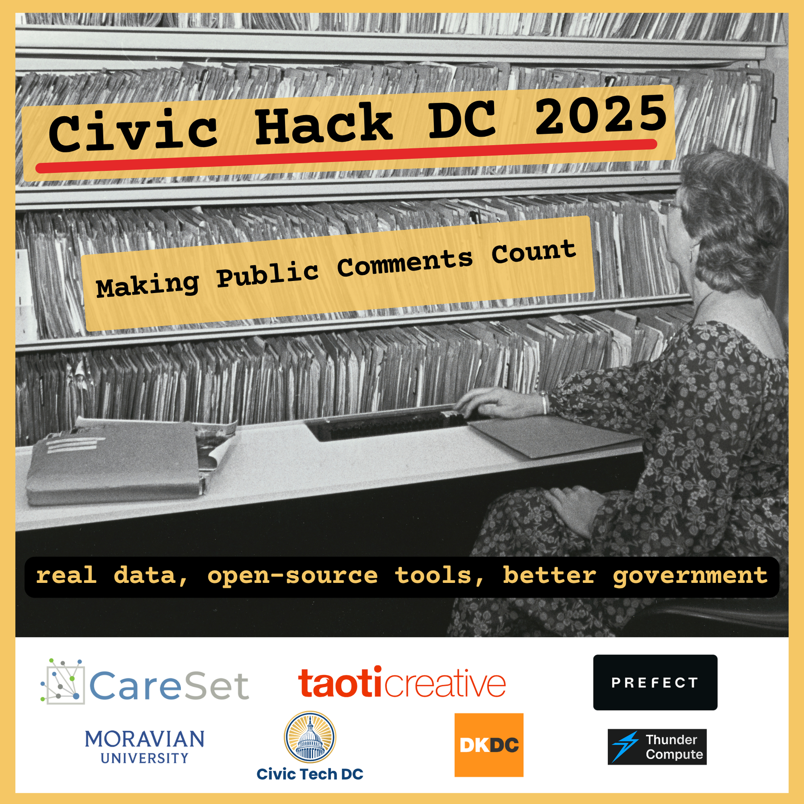
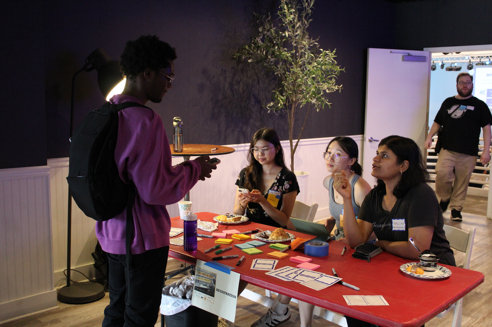
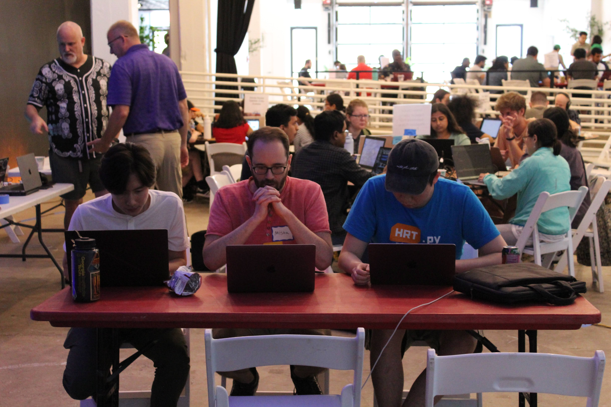
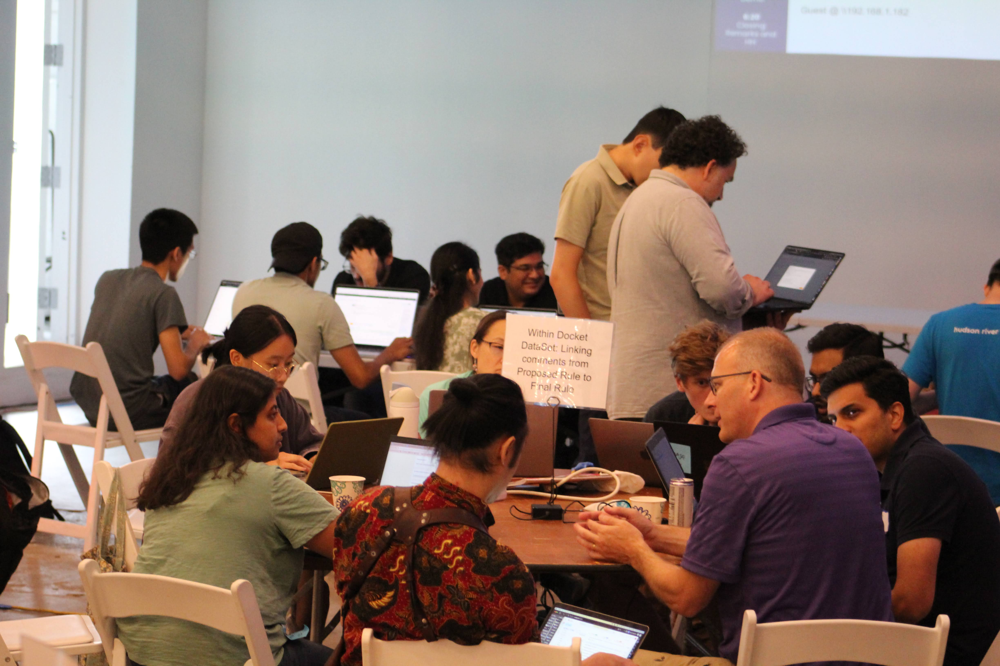

# Civic Hack DC 2025 – Part 1: Making Public Comments Count – Outcomes & Archive



Note: *This repository was created with the aid of Cursor using Claude 4 Sonnet, the content was workshopped by ChatGPT o3 and edited by ChatGPT 4o*

## 🌟 Acknowledgments

We first want to thank the volunteers and participants who made this hackathon possible. The amount of work that went into this was incredible, and we are grateful for the time and effort that everyone put in.

### Sponsors

- **CareSet**(<https://careset.com/>)
- **Taoti Creative**(<https://taoti.com/>)
- **Prefect**(<https://prefect.io/>)
- **Thunder Compute**(<https://thundercompute.com/>)
- **TealWolf Consulting**(<https://tealwolf.consulting/>)

### Partners

- **Moravian University**(<https://www.moravian.edu/>) - Maintaining the Regulations.gov mirror dataset
- **DataKindDC**(<https://www.meetup.com/datakind-dc/>)

This hackathon was made possible by our sponsors, partners, the evaluation panel, and all participants who dedicated their time and creativity to building tools for regulatory transparency.

## 0 · Final Results

### Top-Ranked Projects (Weighted Score ≥ ~3.0) by Alphabetical Order

#### **[Can of Spam](./projects/canOfSpam/README.md)**

- **Breakdown**: Median Scores: Impact 4, Novelty 3, Amplification 3, Open Source 3, Usability 3, Continuity 3
- **Highlights**: Built a proof-of-concept for duplicate and bot comment detection, laying groundwork for campaign analysis.

#### **[Hive-Partitioned Parquet](./projects/hive-partitioned-parquet/README.md)**

- **Breakdown**: Median Scores: Impact 4.5, Novelty 4, Amplification 4, Open Source 4, Usability 3, Continuity 3.5
- **Highlights**: Converted Mirrulations JSON to Hive-partitioned Parquet, enabling efficient SQL querying for large datasets.

#### **[LLM.gov](./projects/llmgov/README.md)**

- **Breakdown**: Median Scores: Impact 5, Novelty 4, Amplification 4, Open Source 4, Usability 4, Continuity 4
- **Highlights**: Combined Retrieval-Augmented Generation (RAG) with vector embeddings for semantic search and summarization. Well-documented.

#### **[Mirrulations-CLI](./projects/mirrulations-cli/README.md)**

- **Breakdown**: Median Scores: Impact 5, Novelty 3.5, Amplification 5, Open Source 5, Usability 4.5, Continuity 4
- **Highlights**: Packaged Mirrulations fetch and CSV tools into a polished CLI for easy installation and use, greatly improving accessibility.

#### **[Rules-Talk](./projects/rules-talk/README.md)**

- **Breakdown**: Median Scores: Impact 4, Novelty 4, Amplification 4.25, Open Source 3.25, Usability 4, Continuity 3.5
- **Highlights**: Used LLMs to cluster sentiment and topics in public comments, making regulatory feedback more digestible for non-technical stakeholders.

#### **[Taskmasters](./projects/taskmasters/README.md)**

- **Breakdown**: Median Scores: Impact 3.5, Novelty 3, Amplification 3, Open Source 2.5, Usability 2.5, Continuity 3.25
- **Highlights**: Developed a pipeline for comments, extracting text from PDFs, DOCX, and images, addressing data quality challenges.

#### **[The Scrapers](./projects/the-scrapers/README.md)**

- **Breakdown**: Median Scores: Impact 4.5, Novelty 3.5, Amplification 3.75, Open Source 3, Usability 3, Continuity 3.25
- **Highlights**: Developed FCC and SEC scraping workflows, expanding the Mirrulations dataset beyond Regulations.gov.

#### **[Within-Docket Dataset](./projects/within-docket-dataset/README.md)**

- **Breakdown**: Median Scores: Impact 4, Novelty 3, Amplification 4, Open Source 3, Usability 2, Continuity 3
- **Highlights**: Created a conceptual pipeline for mapping comment influence on regulatory changes.

---

## 1 · Why This Repository Exists

On July 26 2025, 80 policy experts, data engineers, and civic technologists gathered at **Taoti Creative** to build **open-source tools** that unlock public-comment data from *Regulations.gov* and agency-specific portals.

This repo now serves as the **permanent archive**:

- final project snapshots  
- evaluation results & slide decks  
- cleaned datasets & helper scripts  
- the original problem briefs (for future contributors)  

### Event Photos







Photo Albums:

- Photos by Alex Gurvich, Dean Eby, and the Civic Tech DC team: [Album](https://photos.app.goo.gl/AYcR6qTsjCkaehAy5)

Everything is licensed to encourage reuse and continuation.

---

## 2 · Key Dataset – Mirrulations 🌊

Mirrulations (MIRRor of regULATIONS.gov) is a comprehensive ecosystem developed by [Moravian University Computer Science](https://www.moravian.edu/computer-science) to ingest, process, store, and serve U.S. federal regulatory data from Regulations.gov. It provides a robust, scalable, and accessible way for researchers, developers, and the public to interact with this complex dataset. The system overcomes the API’s 1,000 items/hour limit by using donated API keys to maintain a continuously updated mirror — about 27 million items — including text extracted from PDFs.

| Item | Details |
|---|---|
| **Bucket** | `s3://mirrulations` (AWS Open-Data) |
| **Size** | ≈ 2.3 TB / 27 M items (JSON + attachments) |
| **Docs** | <https://github.com/awslabs/open-data-registry/blob/main/datasets/mirrulations.yaml> |
| **CLI** | `mirrulations-fetch`, `mirrulations-query`, `mirrulations-csv` |
| **Contact** | Prof. Ben Coleman • <colemanb@moravian.edu> |

Mirrulations mirrors *Regulations.gov* hourly, bypassing the API’s 1 000-items/h throttle and extracting text from PDFs so teams can *gulp* data at scale.

There is a [sample slice of the dataset](./datasets/README.md) in this repo.

---

## 3 · What were the problem statements?

| Track                                 | Problem - How can we ...                                                                                                                    |
| ------------------------------------- | ------------------------------------------------------------------------------------------------------------------------------------------- |
| **Entity Resolution**                 | identify and unify organization names across dockets, accounting for aliases and inconsistent naming conventions?                           |
| **Campaign Detection**                | detect duplicate or template-driven comment submissions, including coordinated campaigns and potential bot activity?                        |
| **Position & Sentiment Analysis**     | extract nuanced positions and sentiments from comments beyond simple for/against categorizations?                                           |
| **Influence Mapping**                 | link public comments to specific changes in final rules and identify which commenters influenced regulatory outcomes?                       |
| **Docket-Level Analysis**             | build clear, digestible summaries and insights from tens of thousands of comments within a single docket?                                   |
| **Cross-Docket Analysis**             | map related dockets (RFI → Proposed Rule → Final Rule) and enable search across multiple agencies and rulemaking cycles?                    |
| **Data Accessibility**                | make the mirrored Regulations.gov dataset easier to explore and analyze for researchers and non-technical stakeholders?                     |
| **Agency-Specific Data**              | scrape, integrate, and standardize public comment data from non-Regulations.gov portals (e.g., FCC, SEC, FERC)?                             |
| **Usability for Non-Technical Users** | create interfaces, visualizations, or summaries that make complex regulatory data understandable to advocates, journalists, and the public? |
| **Regulatory Document Navigation**    | surface and summarize the most relevant sections of lengthy, technical regulatory documents to support timely public engagement?            |

For more details, see the [Problem Space Documentation](./docs/README.md).

---

## 4 · What Was Built

| Track | Team Name | Description |
|---|---|---|
| **Campaign Detection** | [**CanOfSpam**](./projects/canOfSpam/README.md) | A data analysis tool for detecting fraudulent bot comments in federal regulatory rule dockets using temporal patterns, submission metadata, and content analysis. Identifies coordinated manipulation campaigns through statistical analysis of comment timing bursts and duplicate detection. Built with Python and Marimo notebooks. |
| **Cross-Docket Analysis & Influence Mapping** | [**Within Docket Dataset**](./projects/within-docket-dataset/README.md) | Links public comments to specific regulatory documents they respond to within a single docket, using metadata analysis, time-window heuristics, and semantic similarity techniques. Helps understand how public comments influence changes from proposed rules to final rules. |
| **Data Accessibility** | [**Hive-partitioned Parquet**](./projects/hive-partitioned-parquet/README.md) | Transforms regulatory data into Hive-partitioned Parquet files for fast and efficient queries using DuckDB. Enables direct querying from S3 with better performance for large-scale regulatory data analysis. |
|  | [**Mirrulations CLI**](./projects/mirrulations-cli/README.md) | Published Python package incorporating scripts from Prof. Ben Coleman to make downloading regulatory data more accessible. Easy to install via pip or use with uvx for streamlined access to Mirrulations data. |
| | [**LLM.gov (CMS Docket Assistant)**](./projects/llmgov/README.md) | An LLM wrapper that utilizes RAG queries to answer general questions about dockets. Transforms complex JSON text into machine-readable vector embeddings stored in S3, enabling semantic search and providing a simple chat interface for non-technical users. |
| **Data Quality & Derived Layers** | [**Taskmasters**](./projects/taskmasters/README.md) | Extracts data from different document types (PDFs, images, documents) while implementing keyword extraction on comments. Converts JSON files to parquet format using AWS S3, Glue, and Athena services for improved data processing efficiency. |
|   | [**Team Velogear**](./projects/team-velogear/README.md) | A command-line tool written in Go that parses text from PDF files and outputs to CSV, JSON, and Parquet formats. Uses pdftotext from poppler-utils for better accessibility of regulatory documents. |
| **Docket-Level Analysis / Topic & Sentiment** | [**Rules Talk**](./projects/rules-talk/README.md) | Policy Comment Analyzer leveraging Google Gemini API to automate analysis of public comments on policy proposals. Extracts key policy information, analyzes comments for specific issues and sentiment, and generates comprehensive reports showing how organizations' critiques and support fit in the conversation. |
| **Entity Resolution** | [**Entity Resolution Team**](./projects/entity-resolution-team/README.md) | Extracts and cleans organization information from comments to group submissions together, even when organization names weren't explicitly listed or had inconsistent naming conventions. Used Jupyter Notebooks for analysis. |
| **External Agency Scraping** | [**The Scrapers**](./projects/the-scrapers/README.md) | Created basic code to scrape other government websites (FCC and SEC) and documented the challenges one may face. Focuses on different scraping methodologies for accessing government data sources. |
| **Regulatory Document Discovery** | [**USPF1**](./projects/uspf1/README.md) | FDA Docket Classification System addressing "Docket Blindness" by automatically analyzing FDA docket comments and generating tags indicating what type of information is needed (Scientific/Technical, Policy/Regulatory, Procedural, etc.). |
| | [**Expanded Search**](./projects/expanded-search/README.md) | A comprehensive search platform that enables citizens to discover relevant regulatory dockets based on their interests. Features Python backend with spaCy NLP keyword extraction, SQLite database, and Angular frontend with Material UI. *(Work in progress)* |
| **Topic & Sentiment Analysis** | [**Team Topic Modeling**](./projects/team-topic-modeling/README.md) | Automated analysis of regulatory documents to identify regulated topics and extract meaningful keywords. Uses spaCy and RAKE for NLP processing, generates visualizations including bar charts and word clouds for each regulatory topic. |

*See `/projects/` for complete code snapshots, data samples, and demo videos.*

---

## 5 · Evaluation Criteria

This is not a competition, but we will evaluate the projects asynchronously to decide which projects to feature, and we'll raffle off prizes to the top 3 projects.

Projects were evaluated based on the following dimensions:

Projects are scored on a 1–5 scale in each category and then multiplied by the weight shown below.

- **Impact & Relevance** – Directly tackles an official problem statement and demonstrates clear civic value or policy impact.
- **Novelty** – How unique is the approach? How does it differ from existing tools?
- **Amplification** – What is the potential for this project to be used by others?
- **Open Source Practices** – Public repo with an OSI‑approved license, focus on open-source tool usage, thorough README, install script, contribution guide, and passing tests/CI.
- **Usability & Design** – Non‑technical users can run the tool or interpret results unaided; thoughtful UX or reporting artifacts provided.
- **Continuity Potential** – Road‑map or issues list, maintainers committed, and a deployment or next‑steps plan that makes ongoing work realistic.

## 📂 Repository Structure

```text
/README.md              – You are here
/LICENSE                – MIT for code, CC-BY 4.0 for docs, CC0 for data samples
/CODE_OF_CONDUCT.md     – Community guidelines
/.github/
    workflows/          – CI for markdown lint and link checking
/docs/                  – Event recap, photos, press, sponsor credits
/docs/problem_space.md  – Problem space and details
/docs/additional_problem_details/ – Additional problem details
    bot_detection.md
    campaign_detection.md
    cross_docket_commenter_threads.md
    docket_mapping.md
    entity_mapping.md
    external_agency_scraping.md
    llm_integration.md
    rule_backlinking.md
    topic_sentiment.md
    download_tools.md
/docs/images/ – Images
/evaluations/
    results.csv         – Raw scoring data
    methodology.md      – Rubric and evaluator details
    summaries.md        – Project descriptions
    submissions/        – Archived individual submissions  
/projects/
    team_name/          – Team project snapshots
        README.md       – Project documentation
        snapshot/       – Code frozen at hackathon
        upstream/       – Live development (submodule)
/datasets/              – Data samples and documentation
/scripts/               – Utility scripts for project maintenance
```

## 🛠️ Technical Details

### Subtree vs Submodule Strategy

We use **git subtrees** with squashed history for hackathon snapshots because they:

- Preserve working code even if original repos disappear
- Allow simple cloning without extra commands
- Keep repository size manageable

For active development, teams can optionally add submodules alongside subtrees.

## 🤝 Post-Hackathon Continuity

This hackathon is only the beginning.

- **Next Steps:** We'll be working on part 2 of the hackathon, which will be announced soon for the fall or spring.
- **Project Archive:** All team projects are archived in `/projects` as subtrees, preserving a snapshot even if upstream repos disappear.
- **Ongoing Development:** We’ll showcase standout projects at Civic Tech DC meetups and help connect teams with partners to keep building.
- **Join Us:** Stay involved through [Civic Tech DC meetups](https://www.civictechdc.org/) and our Slack (see `/docs/` for invite).

## 📧 Contact

- **Event Questions:** [team@civictechdc.org](mailto:team@civictechdc.org)
- **Technical Issues:** Open a GitHub issue
- **Press Inquiries:** [team@civictechdc.org](mailto:team@civictechdc.org)

---

*This repository serves as a permanent archive of Civic Hack DC 2025. For the latest civic tech initiatives in DC, visit [civictechdc.org](https://civictechdc.org/).*
