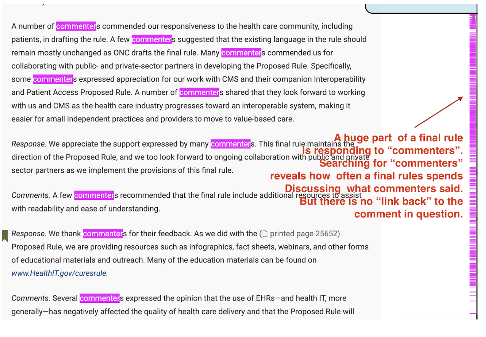

## Within Docket Dataset: Linking Comments from Proposed Rules to Final Rules

### Problem

A huge portion of final rules consists of responding to public comments. Searching for the word “commenters” in these documents reveals how often agencies reference them, but there is no direct “link back” to the original comments. This makes it difficult to assess which feedback influenced regulatory changes.

### Why It Matters

Understanding which comments impacted final rules helps answer one of the biggest questions in regulatory engagement: **On a topic-by-topic basis, which commenters do regulators respect and respond to?**

### Goal

* Link comments from Proposed Rules (PR) to responses in Final Rules (FR).
* Identify where specific comments led to changes in the final rule.
* Combine this mapping with topic extraction and entity identification to show **who influenced which changes**.

### Approach

1. **Diff Analysis**: Compare text between the Proposed Rule and Final Rule to locate changes.
2. **Response Mapping**: Parse the “Response to Comments” sections in Final Rules, linking them to specific comments.
3. **Entity & Topic Integration**: Overlay comment topics and organizational entities to contextualize responses.

**Outcome:** A pipeline that connects public comments to specific rule changes, enabling deeper insights into comment influence and agency responsiveness.

### Visual Example

*Figure: The rule backlinking process showing how comments on proposed rules connect to responses in final rules, enabling analysis of comment influence on regulatory outcomes.*
